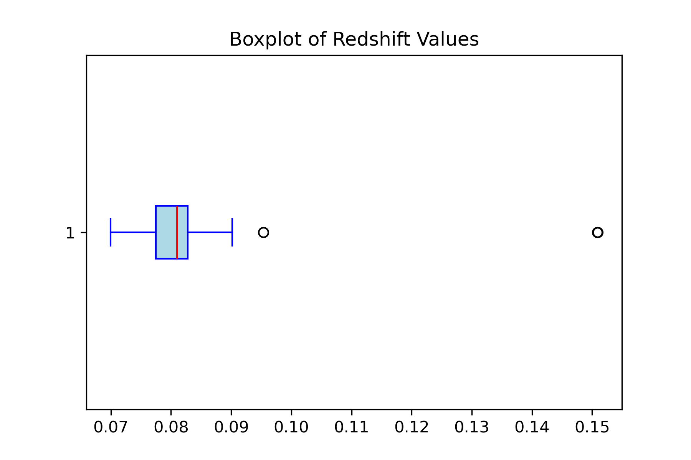
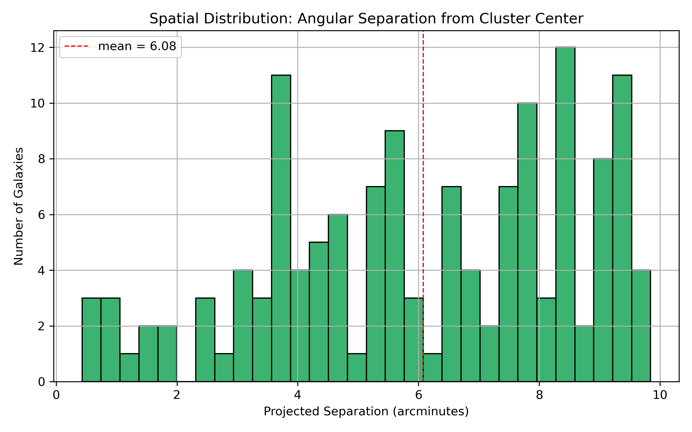
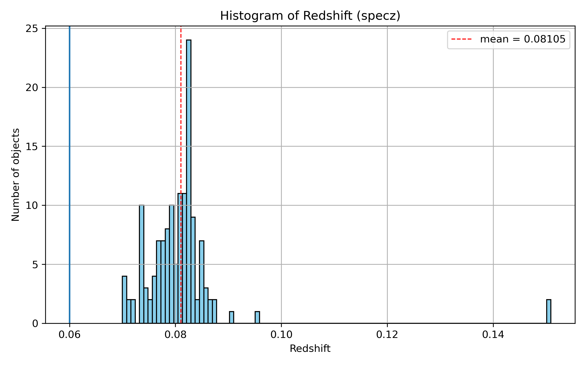
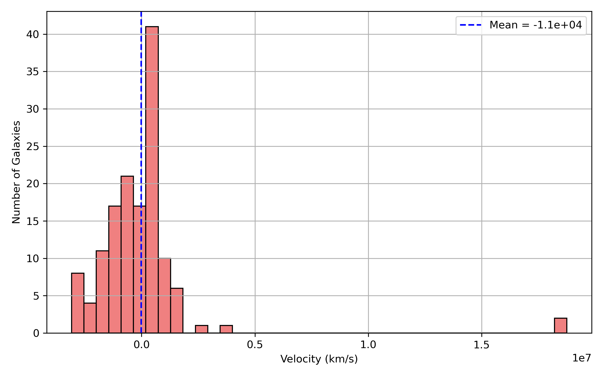

# 🌌 Galaxy Clustering Analysis

Estimate galaxy cluster properties using SDSS FITS data and Python-based analysis.

---

## 🗂 Project Structure

- `notebook/` – Jupyter notebook with all computations
- `data/` – SDSS galaxy cluster FITS data
- `plots/` – All generated plots and visual outputs

---

## 📊 Results and Plots

### Boxplot redshift Plot

### Spatial Distribution: Angular Separation from Cluster Center

### Redshift Histogram

### Histogram Velocity

### Mass Comparison

---

## 🔧 Tools & Libraries Used

- Python
- NumPy, Pandas
- Astropy
- Matplotlib, Seaborn
- Scikit-learn (if clustering applied)

---

## 📝 Summary

This project analyzes SDSS galaxy cluster data to:
- Extract spatial distribution and redshift trends
- Visualize galaxy clustering
- Identify density patterns using basic statistics

---

## 📌 Status

- ✅ Data uploaded
- ✅ Notebook added
- ✅ Plots completed
- ⬜ Paper Write-up (optional)
- ✅ Ready for review
